# Get last-sign-in activity  reports

Shows how to download last sign-in log  on Azure AD  with PowerShell

PowerShell スクリプトにて、ユーザー毎に最終サインイン日時を取得する方法を紹介します。なお、本方法を利用するにはAzure AD Premium P1 ライセンス以上が必要です。

## Azure AD におけるユーザーの最終サインイン日時

現在のAzure AD には、ユーザーの最終サインイン日時を保持するプロパティがないため、ユーザーがいつ最後にサインインしたかという時刻を取得することはできません。Azure AD の開発チームは、プロパティの作成を検討しておりますが、明確な機能追加の時期は発表されていません。

> 2020/10 現在 [Beta 版](https://docs.microsoft.com/ja-jp/graph/api/resources/signinactivity?view=graph-rest-beta)ではございますが、最終サインイン日時が取得可能となりました
> [チームブログにて詳しい採取の仕方](https://jpazureid.github.io/blog/azure-active-directory/azure-ad-get-lastSignInDateTime/)をご紹介しておりますので、よろしければご確認ください。

そのため、一時的な対処策となりますが、ユーザー毎に最終ログイン日時を取得する方法をご用意いたしました。

## 本スクリプトで取得する最終サインイン日時について

本スクリプトではサインインログよりユーザーの最終サインインを取得しています。そのため、以下の点を予めご留意ください。

- サインイン ログの保存期間により、30 日以上前のサインイン日時は確認できません。
- サインインのログから一覧を取得しているため、厳密な ”最終アクセス日時” とは異なります。

## 最終サインイン日時の取得手順

本スクリプトは、キーまたは証明書を利用して最終サインイン日時を取得します。
キーは事前準備が容易であるため、一時的な検証に向いています。
証明書の場合、証明書を作成する事前準備が必要となりますがキーよりも安全であり推奨される方法です。

### 1.事前準備

[スクリプト一式](https://github.com/jpazureid/get-last-signin-reports/archive/stable.zip) をダウンロードし、任意の場所 (以下では C:\SignInReport) に展開します。

- 認証に使用する証明書の作成

CreateAndExportCert.ps1 を実行します。

CreateAndExportCert.ps1 は自己署名証明書を生成し、ユーザーの証明書ストア (個人) に格納します。さらに、公開鍵を含む証明書 (SelfSignedCert.cer ファイル) をカレント  ディレクトリに出力します。キーを利用する場合はこの手順をスキップします。

続けて GetModuleByNuget.ps1 を実行します。

証明書を用いたトークン取得処理に必要なライブラリを nuget で取得します。
GetModuleByNuget.ps1 を実行すると、C:\SignInReport 配下に Tools というフォルダーが作成され Microsoft.IdentityModel.Clients.ActiveDirectory.dll などのファイルが保存されます。

### 2.アプリケーションの登録

Azure AD 上にアプリケーションを準備します。

#### アプリケーションの登録

- Azure ポータルに管理者権限でサインインし、[Azure Active Directory] > [アプリの登録] より、[+新規登録] をクリックします。

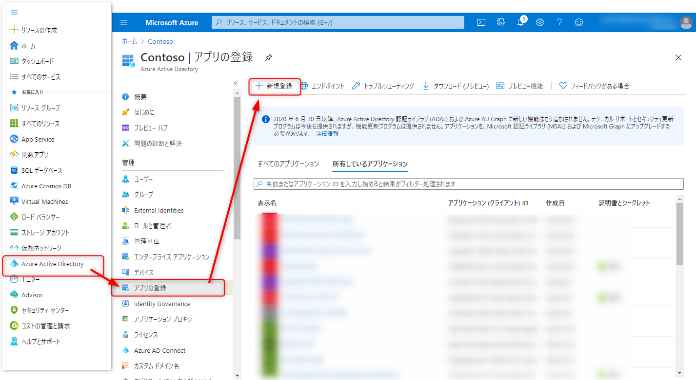

- 任意の名前を選択し、登録を選択します。 

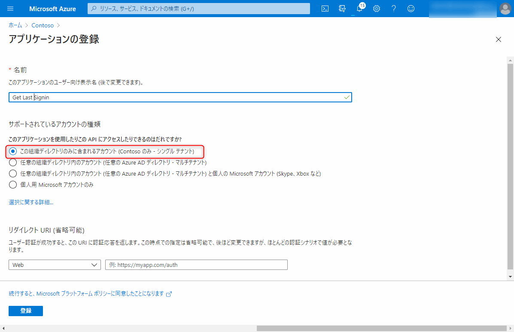

- 表示される概要欄にて、アプリケーション ID とテナント ID を控えておきます。

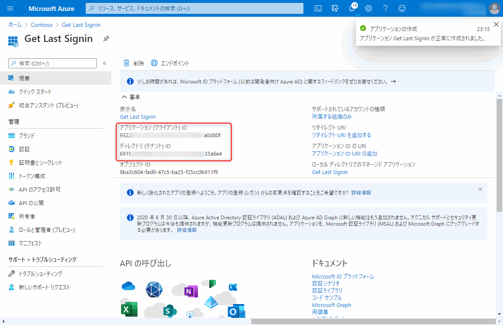

#### API のアクセス許可の設定

- [API のアクセス許可] に移動し、[アクセス許可の追加] をクリックします。

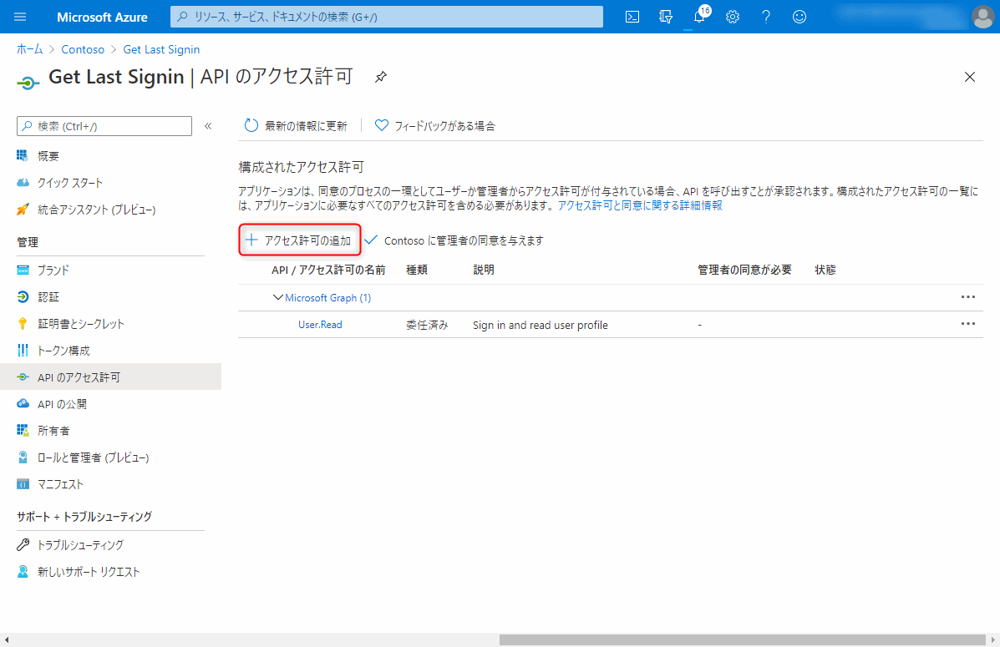

- [Microsoft Graph] を選択します。

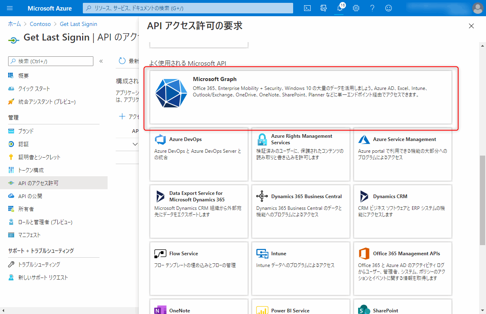

- [アプリケーションの許可] を選択します。

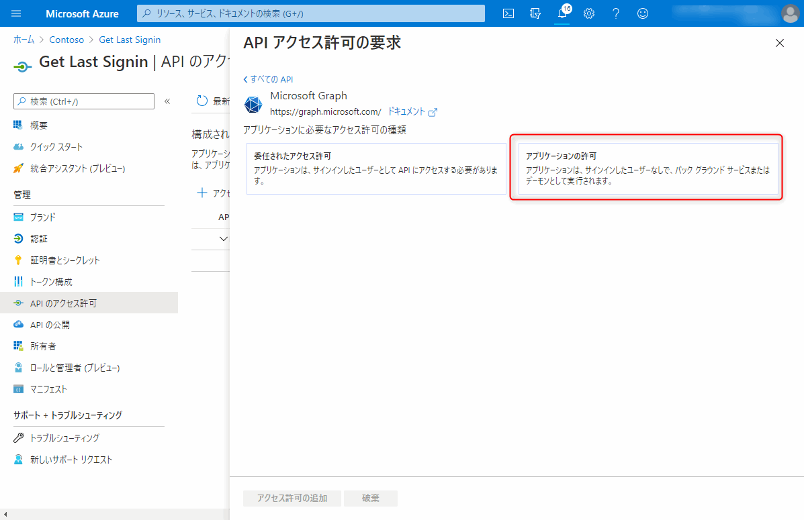

- "Directory.Read.All" のチェックを有効にします。

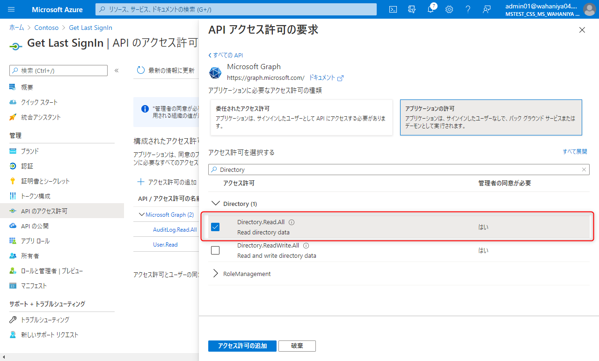

- 続けて "AuditLog.Read.All" のチェックを有効にし、[アクセス許可の追加] をクリックします。

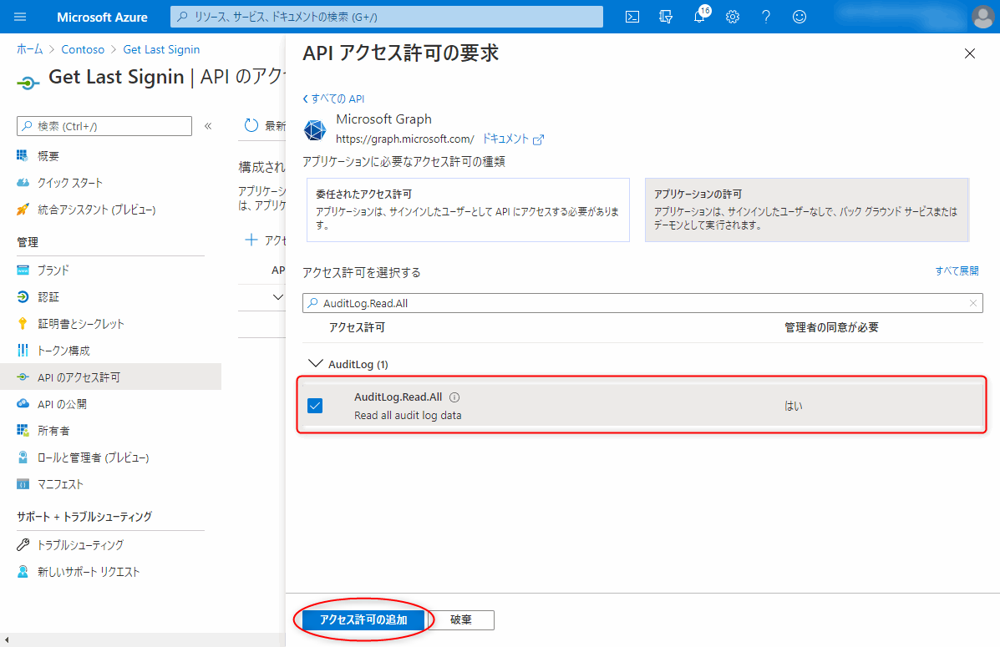

- [<テナント名> に管理者の同意を与えます] をクリックします。

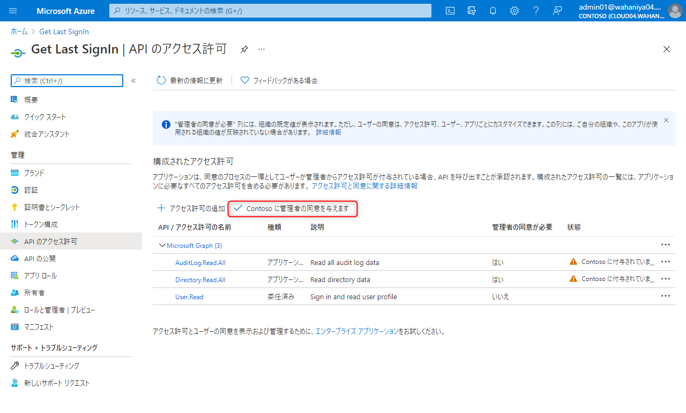

- 確認メッセージで [はい] をクリックし、管理者の同意を付与します。

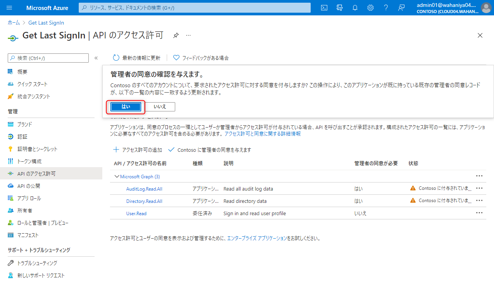

- <テナント名> に付与されました、と表示されていれば完了です。

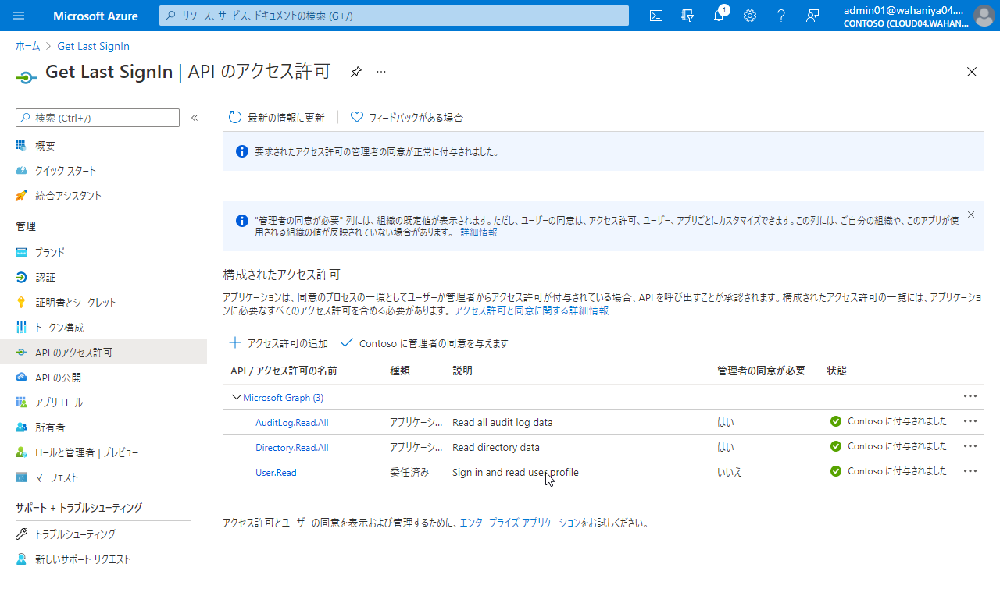

#### 証明書またはシークレットの登録

証明書またはシークレットを登録します。

- [証明書とシークレット] 画面に移動します。

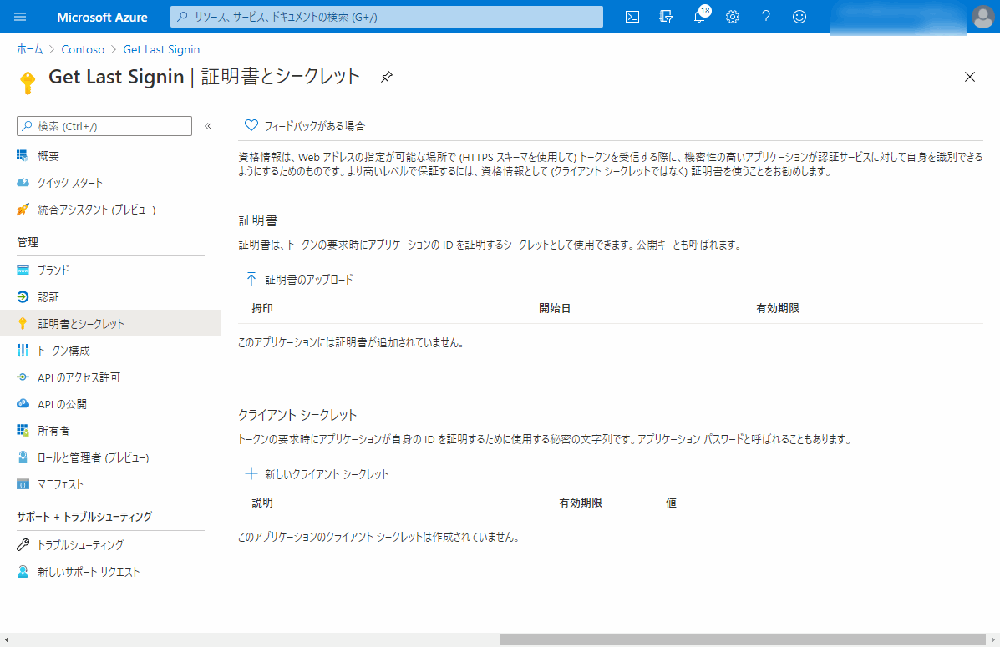

##### 証明書の登録手順

- [証明書のアップロード] をクリックし、表示されるフォルダーボタンをクリックします。ここで、 "1. 認証に使用する証明書の作成" で作成した、 SelfSignedCert.cer を指定します。

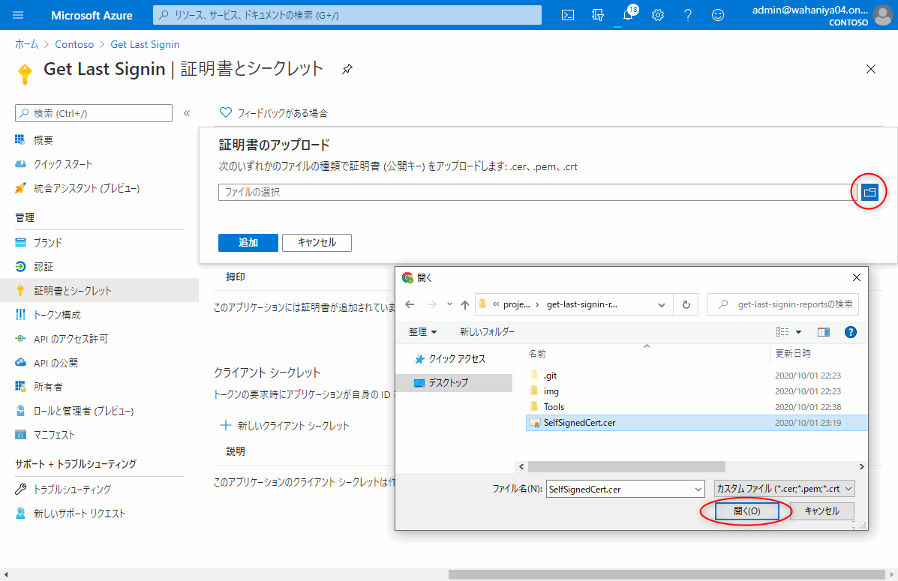

- 証明書をアップロード後、 [追加] をクリックします。

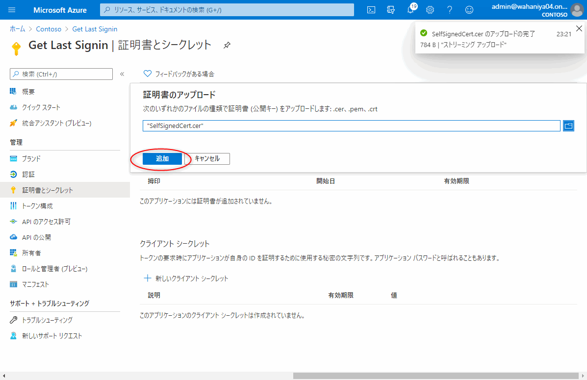

##### クライアント シークレットの登録手順

- [新しいクライアントシークレット] をクリックし、任意の名前を入力し、有効期限を選択後、[追加] をクリックします。

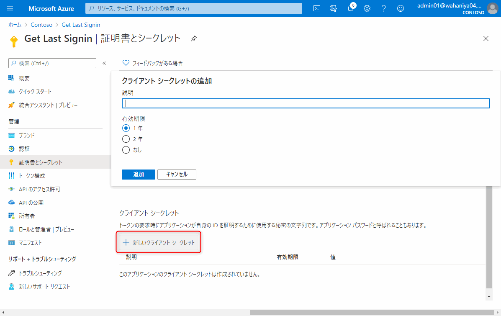

- ページを更新すると閲覧できなくなるため、表示されたシークレットの値をメモします。

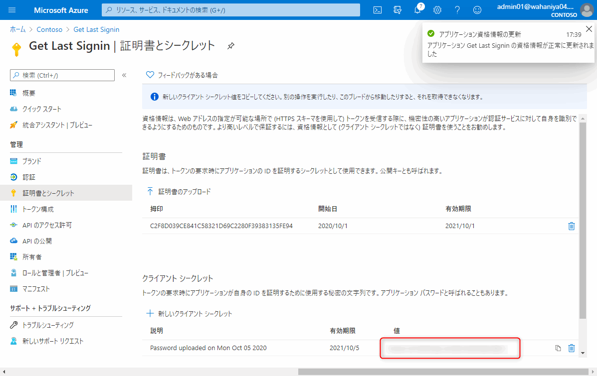

### 3. スクリプトの実行

最後に、C:\SignInReport 配下に保存した GetLastSignIn.ps1 を、環境に合わせて引数を調整し実行します。

キーの場合：

```powershell
.\GetLastSignIn.ps1 -authMethod Key -clientSecretOrThumbprint <手順 2 で作成したクライアント シークレットの値> -tenantId 'contoso.onmicrosoft.com' -clientId xxxxxxxx-xxxx-xxxx-xxxx-xxxxxxxxxxxx -outfile "C:\SignInReport\lastSignIns.csv"
```

> クライアント ID はアプリの登録手順で取得したアプリケーション ID を指定します。
> テナント ID は上記のようにドメイン形式で入力いただくか、アプリケーション ID 同様 GUID 形式で入力いただいても結構です。

証明書の場合：

```powershell
.\GetLastSignIn.ps1 -authMethod Cert -clientSecretOrThumbprint <手順 1 でアップロードした証明書の拇印の値> -tenantId 'contoso.onmicrosoft.com' -clientId xxxxxxxx-xxxx-xxxx-xxxx-xxxxxxxxxxxx -outfile "C:\SignInReport\lastSignIns.csv"
```

### 実行結果

GetLastLogin.ps1 を実行すると、ユーザー毎に最終サインイン日時が csv ファイルとして取得できます。


